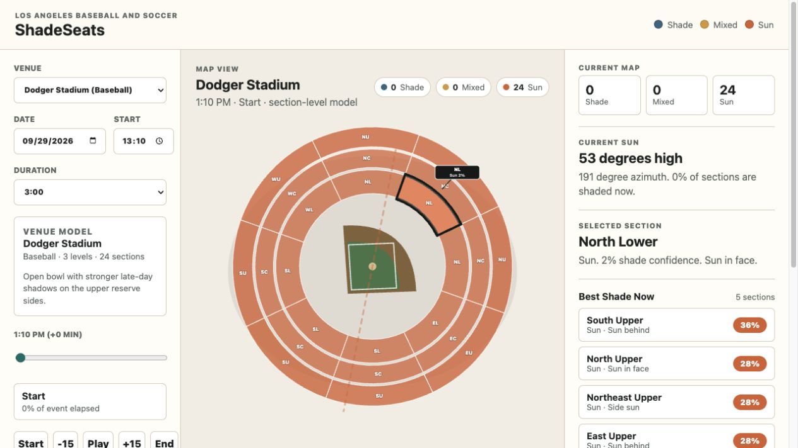
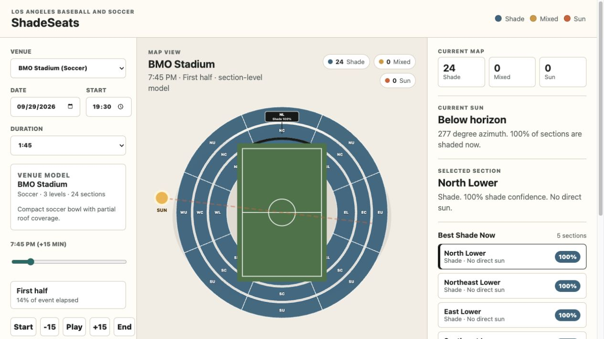

# ShadeSeats

ShadeSeats is a section-level stadium shade estimator for Los Angeles-area baseball and soccer venues. Users choose a venue, event date, start time, and duration, then scrub through the event timeline to see which seating sections are likely in sun, mixed sun/shade, or shade.

This is an MVP. The current app uses simplified stadium geometry and heuristic shade scoring so the product experience can be tested before investing in real section maps, row-level models, roof meshes, or seat-level raycasting.



## What The App Does

ShadeSeats answers a simple event-day question:

> Will this stadium section be in the sun or shade during the game?

The MVP supports:

- LA-area baseball and soccer venues
- section-level shade estimates
- date, start time, and duration controls
- a time slider for moving through the event
- quick timeline buttons: `Start`, `-15`, `Play`, `+15`, `End`
- selected-section details
- section exposure summaries
- live counts of shaded, mixed, and sunny sections
- best-shade section recommendations for the selected time

## Included Venues

- Dodger Stadium
- Angel Stadium
- BMO Stadium
- Dignity Health Sports Park
- Rose Bowl

## How To Use It

1. Select a venue from the venue dropdown.
2. Choose the event date.
3. Set the event start time.
4. Pick a duration, or use the sport-aware default:
   - Baseball defaults to `3:00`.
   - Soccer defaults to `1:45`.
5. Use the time slider or timeline buttons to move through the event.
6. Click a section on the stadium map.
7. Read the selected section panel to see:
   - shade status
   - shade confidence
   - sun/glare direction
   - timeline exposure



## Understanding The Map

Each section is color-coded:

- Blue: likely shaded
- Yellow: mixed or uncertain
- Orange: likely exposed to sun

The map currently uses generated section labels:

- `N`, `NE`, `E`, `SE`, `S`, `SW`, `W`, `NW` describe the section direction.
- `L`, `C`, `U` describe the level: lower, club, upper.

Examples:

- `NL` means North Lower.
- `NC` means North Club.
- `NU` means North Upper.
- `WU` means West Upper.

These are placeholder labels for the MVP. A future version should replace them with real stadium sections such as `Section 112`, `Reserve 10`, or `Field 24`.

## Timeline Controls

The timeline controls let users inspect shade throughout the event:

- `Start`: jump to the beginning of the event
- `-15`: move backward 15 minutes
- `Play`: animate through the event
- `+15`: move forward 15 minutes
- `End`: jump to the end of the event

The app also labels the event phase. Baseball uses labels like `Early game`, `Middle innings`, and `Late game`. Soccer uses labels like `First half`, `Halftime window`, and `Second half`.

## Selected Exposure Summary

When a section is selected, the right panel shows how much of the event is expected to be:

- sun
- mixed
- shade

For example:

```text
100% sun · 0% mixed · 0% shade
```

or:

```text
0% sun · 0% mixed · 100% shade
```

This helps users compare sections based on the full event, not just the current moment.

## How It Works

The app is split into a few small pieces:

```text
data/
  venues.json
  section-levels.json
  compass-zones.json

src/
  app.js
  data.js
  solar.js
  shade.js
```

### Venue Data

Venue configuration lives in JSON files:

- `data/venues.json`: venue coordinates, sport, orientation, start time, and coverage assumptions
- `data/section-levels.json`: lower, club, and upper ring geometry
- `data/compass-zones.json`: generated directional zones

### Solar Engine

`src/solar.js` calculates the sun position for the selected venue and time.

It returns:

- sun elevation
- sun azimuth

### Shade Scoring

`src/shade.js` builds generated sections and scores them based on:

- sun elevation
- sun azimuth
- venue rotation
- section direction
- rim shadow assumptions
- upper-level or canopy coverage assumptions

Each section receives:

- `shadeScore`: `0` to `1`
- `status`: `sun`, `mixed`, or `shade`
- `glare`: `Sun in face`, `Side sun`, `Sun behind`, or `No direct sun`

### UI Layer

`src/app.js` renders the controls, stadium SVG, selected section panel, timeline controls, and exposure summaries.

## Run Locally

This app loads JSON files, so serve the folder locally instead of opening `index.html` directly.

```bash
cd /Users/hansolji/Desktop/shadeseats
python3 -m http.server 4173
```

Then open:

```text
http://localhost:4173/?fresh=timeline-controls-2
```

If the UI looks stale, hard refresh the browser:

```text
Cmd + Shift + R
```

## Docker

Build and run the Nginx container:

```bash
docker build -t shadeseats-static-mvp .
docker run --rm -p 8080:80 shadeseats-static-mvp
```

Then open:

```text
http://localhost:8080/?fresh=timeline-controls-2
```

## Verification

Run all current verification checks:

```bash
npm run verify
```

Run individual checks:

```bash
npm run verify:solar
npm run verify:shade
```

The solar check validates basic daylight/night behavior and Pacific time offsets. The shade check validates generated section counts and basic scoring behavior.

## Current Limitations

This is not yet a seat-level or row-level model.

Current limitations:

- sections are generated directional zones, not real venue section polygons
- roof and canopy coverage is approximate
- no row depth modeling yet
- no exact obstructions, scoreboards, or nearby structures
- no weather/cloud cover
- no ticket marketplace integration

The app should be presented as a section-level estimate, not a guarantee.

## Planned Improvements

Likely next product steps:

- replace generated section labels with real venue section names
- add real section boundary data
- add row-level geometry
- add roof/canopy geometry
- precompute shade maps for common event times
- add a backend API
- add PostGIS or another geometry-aware data layer
- eventually support seat-level shade estimates


